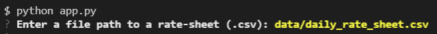
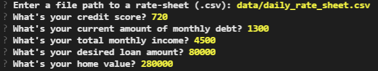
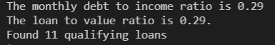
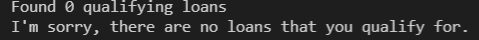
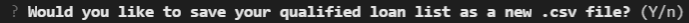
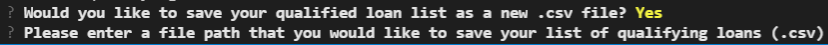

# Loan Qualifier Application
 
The Loan Qualifier Application adds qualifying features to a loan analyzer program. The program can read different bank offering   (.csv) files to determine what each user qualifies for. The application uses CLI to prompt the user to answer financial questions, the user can then choose to save the qualified bank list and select their preferred file location.

---

## Technologies

This program uses Python 3.9 with the following libraries:
Questionary,
Pathlib,
Fire,
csv,
sys

---

## Installation Guide

Clone the loan_qualifier_application respository (https://github.com/Kevinator9000/loan_qualifier_app) to your own local respository.

---

## Usage
1: You will be prompted to input the file path in order to load the bank's data, for now use the path `data/daily_rate_sheet.csv`.

2: You will be asked to input your: Credit Score, Monthly Debt, Total Monthly Income, Desired Loan Amount, and lastly Home Value.

3: This information is passed through multiple functions which filter your: Credit Score, Debt to Income Ratio, Loan to Value Ratio, and Maximum Loan Size. After the program calculates your information it will display your Monthly Debt to Income Ratio, Loan to Value Ratio, and return the total number of loans that you have qualified for.

If the user did not qualify for any loans the program will send this message and close.

4: The program will ask you if you would like to save your qualifying loans list.

If you answer no, then the program sends a farewell message and closes.

5: If you answer yes, the program then prompts you to input a .csv file location for your new Qualified Loans list.

---

## Contributors

Kevin Gross

---

## License

MIT license
